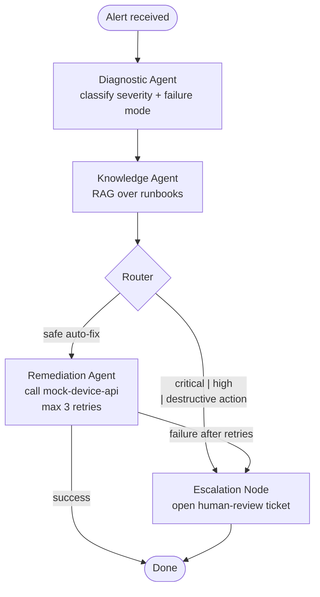

# Ranger — Multi-Agent IoT Incident Triage

Ranger is an agentic system that autonomously triages and remediates IoT device incidents. Alerts come in (from a monitoring system like its sibling project [Sentinel](#companion-project)), a LangGraph state machine reasons through diagnosis → runbook retrieval → remediation or escalation, and every step is streamed to an operator dashboard and persisted as an audit trail.

The point of this project is to demonstrate a set of production-shaped patterns for agentic AI: **explicit state machines**, **RAG-backed knowledge**, **safe auto-remediation with human-in-the-loop escalation**, and **provider-agnostic LLM routing**.

## Architecture

```
┌────────────┐         ┌─────────────────────────────────────┐         ┌──────────────────┐
│  Operator  │◀────────│  Frontend  (React + Vite)           │         │   LLM Providers  │
│  browser   │         │  Dashboard · Alert timeline · Admin │         │  OpenAI Anthropic│
└────────────┘         └──────────────────┬──────────────────┘         │  Gemini xAI Ollama│
                                          │ REST + WebSocket           └──────────┬───────┘
                                          ▼                                       │
                       ┌──────────────────────────────────────┐   LiteLLM         │
                       │  API  (FastAPI · async)              │───────────────────┘
                       │  ┌────────────────────────────────┐  │
                       │  │  LangGraph state machine       │  │
                       │  │  ┌─────┐ ┌─────┐ ┌─────┐ ┌───┐ │  │   HTTP
                       │  │  │Diag │→│Know │→│Reme │→│End│ │  │─────────────▶  ┌──────────────────┐
                       │  │  └─────┘ └─────┘ └─────┘ └───┘ │  │                │ mock-device-api  │
                       │  │           │        │           │  │                │  /restart /sync  │
                       │  │           │        ▼           │  │                └──────────────────┘
                       │  │           │       Escalate     │  │
                       │  │           ▼                    │  │
                       │  │    ChromaDB (embedded)         │  │
                       │  └────────────────────────────────┘  │
                       └──────────────────┬───────────────────┘
                                          │
                                          ▼
                                 ┌─────────────────┐
                                 │   PostgreSQL    │
                                 │  alerts · runs  │
                                 │  steps · keys   │
                                 └─────────────────┘
```

A proper diagram lives at [docs/architecture.png](docs/architecture.png) (placeholder until rendered).

## Agent flow



Every transition writes a row to `agent_steps` with `(node, input_state, output_state, llm_calls, tokens, duration_ms)`. That's the audit trail — the same data powers the operator timeline UI.

## Tech stack

| Layer              | Choice                                                  |
|--------------------|---------------------------------------------------------|
| Agent framework    | LangGraph                                               |
| LLM abstraction    | LiteLLM (OpenAI, Anthropic, Gemini, xAI Grok, Ollama)   |
| Vector DB          | ChromaDB (embedded, persistent volume)                  |
| Embeddings         | `sentence-transformers/all-MiniLM-L6-v2`                |
| API                | FastAPI · Pydantic v2 · uvicorn · async SQLAlchemy      |
| Database           | PostgreSQL 16 · Alembic                                 |
| Secrets at rest    | Fernet (`cryptography`)                                 |
| Frontend           | Vite · React 18 · TypeScript · Tailwind · shadcn/ui     |
| State (frontend)   | TanStack Query · custom `useWebSocket`                  |
| Orchestration      | Docker Compose v2                                       |

## Quick start

### Prerequisites
- Docker Desktop (or equivalent) with Compose v2
- `make`
- An API key for at least one LLM provider (OpenAI / Anthropic / Gemini / xAI), *or* Ollama running locally

### 1. Configure environment

```bash
cp .env.example .env
# Generate a Fernet key and paste it into .env as RANGER_ENCRYPTION_KEY:
python -c "from cryptography.fernet import Fernet; print(Fernet.generate_key().decode())"
```

### 2. Start the stack

```bash
make up        # builds + starts postgres, api, mock-device-api, frontend
make logs-api  # watch migrations run and runbooks index on first boot
```

First boot takes ~30–60s because the api container downloads the embedding model and indexes the 15 runbooks into ChromaDB.

### 3. Configure an LLM provider

1. Open <http://localhost:5173/admin/settings>.
2. Enter your admin token (default `change-me-dev-only`, set in `.env`).
3. Paste an API key for any provider and click **Test**. A successful test makes a 5-token completion call.
4. Select the active provider + model and **Save**.

### 4. Trigger a triage run

```bash
make test-alert
```

Or open the dashboard, click **Submit test alert**, then click into the alert to watch the agent timeline stream live.

## Key design decisions

**Why LangGraph over CrewAI / AutoGen?** Ranger's core value proposition is *auditability* — every reasoning step must be inspectable after the fact for ops sign-off. CrewAI and AutoGen emphasize emergent multi-agent collaboration where control flow is implicit; LangGraph forces an explicit state machine with named nodes and typed transitions, which maps 1:1 to the `agent_steps` audit table.

**Why LiteLLM over LangChain's per-provider chat models?** LangChain's abstractions add surface area (message types, callbacks, partials) that don't pay for themselves when all you need is "call a chat completion." LiteLLM is a thin function call that normalizes five providers behind `acompletion(model=..., messages=...)` — the exact scope needed. Swapping providers is a string change, not a refactor.

**Why an explicit state machine for auditability?** In regulated environments (healthcare, logistics, facilities management) an "AI took an action" event has to be defensible. An explicit graph means the answer to *why did the agent call `restart_device`?* is one SQL query: read `agent_steps` in order, each row has the LLM prompt, response, and the deterministic routing decision that followed.

**Why Fernet for provider keys?** API keys live in Postgres alongside everything else (one backup boundary). Fernet is symmetric AEAD — authenticated, versioned, simple API. The encryption key is env-injected and never persisted, so compromising the database alone doesn't leak provider credentials. For production I'd swap this for a KMS-backed envelope encryption scheme; Fernet is the right demo-scale primitive.

**Why ChromaDB embedded?** 15 runbooks, single-writer, no HA requirement. Running Chroma as a separate service would add a container, a health check, and a network hop for zero operational benefit at this scale. If the runbook corpus grows past ~10k chunks I'd move to `pgvector` (single DB, one backup) rather than a standalone vector service.

**Why are agents async tasks inside the api process (no worker service)?** Alerts are low-volume (~tens per hour even in a busy facility). Adding Celery/Redis/RQ triples the operational footprint for negligible throughput gain. The boundary is clean — `POST /alerts` returns a `run_id` immediately and backgrounds the graph — so splitting into a dedicated worker later is a lift-and-shift, not a redesign.

## Companion project

Ranger is one half of a pair. Its sibling, **Sentinel**, detects anomalies in IoT telemetry streams and emits the alerts Ranger triages. They're independently useful but designed to interop: Sentinel's alert schema is Ranger's `POST /alerts` request body.

## Future work

- **Real auth.** Replace the shared admin token with OIDC (role-based: operator vs. admin) and per-user API keys for the alert ingestion endpoint.
- **LangGraph checkpointing.** Swap the in-memory checkpointer for `PostgresSaver` so agent runs survive api restarts and can be resumed / replayed for post-incident review.
- **Per-agent LLM selection.** Let operators route `diagnostic_agent` to a cheap fast model (Haiku) and `knowledge_agent` to a better reasoning model (Opus/Sonnet) independently.
- **Cost tracking dashboard.** `agent_steps` already records tokens per call; surface $/alert and $/provider over time with a provider-price table.
- **Human feedback loop.** An operator can thumbs-down a triage run; that signal feeds a small fine-tuning or few-shot selection loop for the diagnostic prompt.
- **Streaming remediation.** Long-running device actions (firmware updates) should stream status back, not just return a final result.
- **WebSocket auth.** Admin token currently only gates HTTP routes; extend to WS upgrade request.

## Repo layout

Current state: root orchestration (compose + env + make) only — services are being scaffolded incrementally. The target tree is documented in the project kickoff spec.

## License

MIT.
